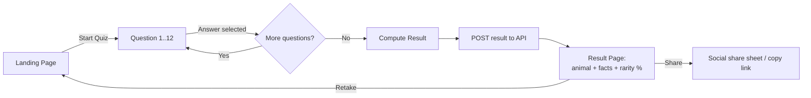
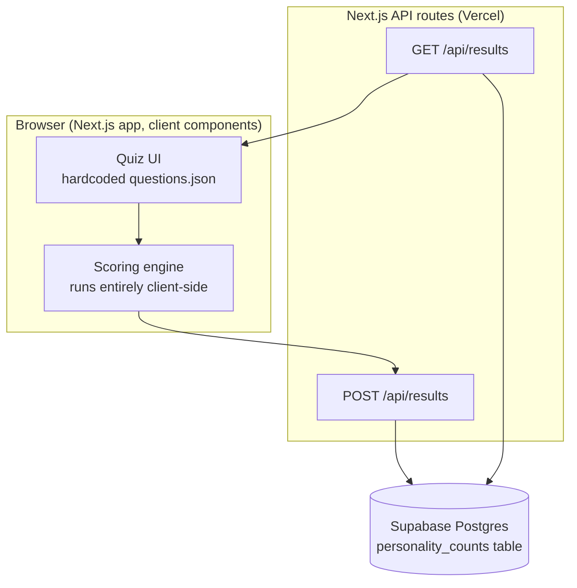

# Mandai Personality Quiz — Product & Technical Proposal

**Status:** Draft for stakeholder review
**Author:** Drafted with Claude, for Merrick
**Date:** 2026-07-26

---

## 1. Overview

A 12-question personality quiz. Each visitor answers 12 multiple-choice questions and is mapped to **1 of 25 Mandai wildlife characters**. The result page reveals the character, some fun facts about it, and — new versus anything in the reference product — **how common that result is** across everyone who has taken the quiz so far ("14.29% of visitors got the Otter too").

**Reference teardown:** [CosmosPersona](https://iseej.github.io/CosmosPersona/index.html) was reviewed directly (source inspected on GitHub). It's a static, client-only MBTI-style quiz: 12–13 sequential questions, each answer nudges one of 8 dichotomy letters (E/I, S/N, T/F, J/P), the four winning letters concatenate into a 4-letter code, and that code looks up one of 16 fixed result images. There is **no backend, no persistence, and no frequency tracking** — everything resets on refresh. We're keeping the sequential one-question-at-a-time flow and the single-page feel, but replacing the binary MBTI scoring (which caps at 16 outcomes) with a model that scales to 25, and adding the count-tracking feature from scratch.

**Goals**
- Fun, fast (~2–3 min), mobile-first quiz experience for park visitors / website visitors.
- Educational payoff: each result teaches the user something real about a Mandai animal.
- Light social proof / shareability via the "how common is my result" stat.

**Non-goals (v1)**
- Accounts, login, or saving quiz history per user.
- A CMS for editing questions — confirmed these are hardcoded in the frontend.
- Admin dashboard for viewing stats (can be a fast follow; v1 only needs the public-facing percentage).

---

## 2. User Flow



No back button in the quiz (matches reference behavior, keeps the funnel simple) — open question in §11 if stakeholders want it.

---

## 3. Functional Requirements

| ID | Requirement | Acceptance Criteria |
|----|---|---|
| FR-1 | **Landing page** | Shows title, short intro copy, hero image/animation, single primary "Start Quiz" CTA. |
| FR-2 | **Quiz engine** | Displays one question at a time, 12 questions total, each with 2–4 MCQ options (final content TBC). Progress indicator (e.g. "Question 4 of 12" + progress bar). Selecting an answer auto-advances to the next question — no separate "Next" click, matching reference UX. |
| FR-3 | **Scoring engine** | Accumulates a trait score across all 12 answers client-side; on the last question, computes the single best-matching animal out of 25 (see §5.2 for the algorithm). Deterministic: same answers always produce the same result. |
| FR-4 | **Result page** | Displays the matched animal's name, image/illustration, a short personality blurb, and 3–5 fun facts. |
| FR-5 | **Frequency tracking** | On reaching the result, the frontend fires one `POST` to record that this animal was matched. It then fires (or reuses the response of) a `GET` to fetch and display that animal's share of all results to date, formatted to **2 decimal places** (e.g. `14.29%`). |
| FR-6 | **Duplicate-submission guard** | Refreshing or revisiting the result page must not double-count. A completed session is flagged client-side (`sessionStorage`) so the `POST` fires exactly once per completed quiz attempt. |
| FR-7 | **Retake** | A "Retake Quiz" action on the result page resets state and returns to the landing page or straight to Question 1. |
| FR-8 | **Share result** | Confirmed in-scope for v1. A "Share" button on the result page lets a visitor share their result *with a screenshot-style image and a link back to the quiz*. On mobile (Web Share API support), tapping Share opens the native share sheet with a generated result-card image + the site URL pre-filled. On desktop, or where Web Share isn't available, fall back to: a downloadable result-card image (PNG) plus a "Copy link" button. See §8.8 for how the image is generated. |

---

## 4. Non-Functional Requirements

- **Mobile-first**: primary usage is expected to be on phones (in-park QR code scan or social sharing). Design and test mobile viewport first, desktop second.
- **Performance**: no heavy frameworks beyond what's proposed; images optimized (WebP/AVIF with fallback), quiz must feel instant — no network round-trip between questions (all client-side until the final result).
- **Accessibility**: minimum WCAG AA color contrast, visible keyboard focus states, answer buttons reachable and operable via keyboard, `alt` text on all animal/question imagery.
- **Resilience of the count feature**: if the `POST`/`GET` to the backend fails (network issue), the result page must still render the animal and facts — the rarity stat is a progressive enhancement, not a blocker. Show a graceful fallback (e.g. stat section hidden or "—%").
- **Abuse resistance**: a single visitor should not be able to trivially spam the count for one animal. v1 relies on the client-side one-submit guard (FR-6); IP-based rate limiting is noted as a phase 2 hardening step (§8.6), not required for launch given expected traffic levels.
- **Browser support**: last 2 versions of Chrome, Safari, Edge, Firefox; iOS Safari and Chrome Android specifically (mobile-first).

---

## 5. Content & Scoring Model — PLACEHOLDER, pending Mandai input

Confirmed open dependency: **the 25 animal roster/content and the 12 questions/answers are not yet available** and will come from the Mandai team separately. Everything in this section uses placeholder data so the build can proceed in parallel; real content drops in without changing the architecture.

### 5.1 Placeholder content shape

Until real content arrives, we'll build against a fixture like this (illustrative, not final):

```json
// animals.json (placeholder — 25 entries)
{
  "id": "otter",
  "name": "Otter",
  "tagline": "Playful and social, always up for an adventure with the group.",
  "facts": [
    "Otters hold hands while sleeping so they don't drift apart in the water.",
    "A group of otters is called a 'raft'.",
    "Smooth-coated otters can be spotted right here in Singapore's waterways."
  ],
  "image": "/animals/otter.png",
  "traits": { "energy": 8, "social": 9, "boldness": 6, "playfulness": 9, "role": 3 }
}
```

```json
// questions.json (placeholder — 12 entries)
{
  "id": "q1",
  "prompt": "It's a free Saturday morning. What are you doing?",
  "image": "/questions/q1.png",
  "answers": [
    { "text": "Rounding up friends for an outdoor adventure", "traits": { "energy": 2, "social": 2, "boldness": 1 } },
    { "text": "Quiet coffee and a book, thanks", "traits": { "energy": -1, "social": -2, "boldness": -1 } }
  ]
}
```

### 5.2 Scoring algorithm (recommended: trait-vector matching)

The reference site's binary-letter model tops out at 16 outcomes (2⁴) because it only tracks 4 yes/no dichotomies. Forcing 25 outcomes out of that model would mean hand-mapping every one of the ~4,096 possible answer combinations to a specific animal — not workable, and it doesn't scale if the animal roster changes.

Instead, define a small set of **personality trait axes** (placeholder set of 5 above: energy, social, boldness, playfulness, role — final axes to be agreed with Mandai's content team based on what actually differentiates the 25 animals). Then:

1. Each **animal** gets a fixed trait vector (one row of numbers per animal, authored once by the content team — e.g. a spreadsheet).
2. Each **question answer** carries a small trait delta (e.g. `{ energy: +2, social: +1 }`).
3. As the user answers, sum the deltas into a running **user vector**.
4. At the end, compute similarity (cosine similarity, or negative Euclidean distance) between the user vector and all 25 animal vectors. Highest similarity wins.
5. **Tie-break**: if two animals tie exactly, pick the lexicographically smallest `id` — keeps results deterministic and testable (same answers ⇒ same animal, always).

```
function matchAnimal(userVector, animals):
    best = null, bestScore = -Infinity
    for animal in animals (sorted by id):
        score = cosineSimilarity(userVector, animal.traits)
        if score > bestScore:
            best = animal, bestScore = score
    return best
```

This scales to any number of animals and any content changes without touching the scoring code — only the data files change. Content-authoring burden: **5 axes × 25 animals + 5 axes × ~24 answer options ≈ 245 numbers**, versus ~600+ hand-written branch cases under a direct-mapping approach.

**Fallback alternative (simpler, more manual):** if Mandai's team would rather not think in trait axes, we can instead have each answer directly award points to specific animals (e.g. answer A gives +3 to Otter, +1 to Tiger). This is easier to reason about per-question but requires the content team to fill in a 12×25 grid per answer, and doesn't generalize as cleanly if animals are added/removed later. Recommend trait-vector approach; flagging both so the content team can pick.

---

## 6. Mockups

**Status: not yet built — holding for plan sign-off first**, per your direction. Once this document is approved, the next step is an interactive HTML prototype covering the three core screens (Landing → Quiz → Result, including the rarity stat and the new Share action).

**Visual direction:** explicitly *not* a reskin of CosmosPersona's look (flat sci-fi/cosmic, GIF-driven). You shared a reference mural — a densely painted jungle scene with macaw, orangutan, hornbill, panda, giraffe, elephant, flamingo, and manatee among lush tropical foliage under a golden-hour sky (saved to `docs/design-reference/jungle-mural-reference.png`). That's the tonal direction: rich, illustrated jungle/wildlife, not a flat corporate UI theme. What we borrow from the reference site is purely the *interaction pattern* (one question at a time, auto-advance, progress indicator) — not its visual language.

Since real illustration assets in that style aren't available yet, the prototype will use a placeholder palette and placeholder shapes/icons *inspired by* that direction (foliage greens, warm sunset accent, organic shapes) clearly marked as placeholder — swapped for real brand assets once the design team delivers them (§7).

Screens the prototype will cover:
1. **Landing** — title, intro line, hero art placeholder (in the jungle-mural spirit), Start CTA.
2. **Quiz, mid-progress** — question, image placeholder, two answer buttons, progress bar showing "Question X of 12".
3. **Result** — animal reveal, blurb, fun facts, the rarity stat (e.g. "14.29% of visitors got this animal too") as a hero number + proportion bar, plus Retake and **Share** actions (FR-8).

---

## 7. Required Assets Checklist (for design/content team)

| Asset | Format | Quantity | Notes |
|---|---|---|---|
| Animal illustrations | PNG/SVG, transparent bg, ≥1000px | 25 (1 per animal; square crop + optional full-body) | Needed before result page can use real art |
| Animal fun facts | Copy, 3–5 short facts each | 25 sets | Keep each fact ≤ 1–2 sentences for mobile |
| Animal personality blurb | Copy, 1–2 sentences | 25 | The "you got X because Y" line |
| Animal trait scores | Spreadsheet: 1 row per animal × agreed trait axes | 25 rows | Needed for scoring engine (§5.2); we can facilitate a workshop to define the axes with the content team |
| Quiz questions + answer copy | Copy | 12 questions × 2–4 answers each | Also needs trait deltas per answer once axes are agreed |
| Question imagery/icons (optional) | PNG/SVG or Lottie | 12 | Reference site uses a themed GIF per question; illustration or icon is fine too |
| Brand colors & type | Style guide / Figma tokens | — | Prototype will use a placeholder jungle/wildlife palette (inspired by the mural reference you shared) until real tokens land |
| Logo / favicon | SVG + PNG/ICO | 1 set | For header, browser tab, and the share-card (§8.8) |
| Share-card template elements | Mandai logo (transparent), site URL/QR mark | 1 set | Composited onto the auto-generated per-animal share image (FR-8) — doesn't need 25 separate designs, just the fixed logo/URL overlay |
| Loading/transition animation (optional) | Lottie/GIF | 1 | Nice-to-have polish, not blocking |

---

## 8. Technical Design

### 8.1 Architecture



- **Frontend:** Next.js + React + Tailwind, deployed on Vercel.
- **Backend:** two thin Next.js API routes — no separate service needed.
- **Database:** Supabase (managed Postgres), one table.
- Questions, answers, and animal content are **static JSON/TS files bundled with the app** — no CMS, no database round-trip for content. Supabase is used purely for the result counts.

### 8.2 Data model

```sql
create table personality_counts (
  animal_id   text primary key,      -- matches the static animals.json id, e.g. "otter"
  count       integer not null default 0,
  updated_at  timestamptz not null default now()
);
```

25 rows, one per animal, seeded at `count = 0` via a migration/seed script once the real animal roster is confirmed.

### 8.3 API contract

**`POST /api/results`**
Records one completed quiz result and returns the updated stat for that animal.

```
Request:  { "animalId": "otter" }
Response: { "animalId": "otter", "count": 143, "percentage": 14.29 }
```

Implementation note: increment atomically to avoid race conditions under concurrent traffic — use a single `UPDATE personality_counts SET count = count + 1 WHERE animal_id = $1 RETURNING count` (or a Postgres function via `supabase.rpc()`), not a read-then-write from the app.

**`GET /api/results`**
Returns the current distribution across all animals (used to compute the percentage shown on the result page, and could back a future "explore all animals" gallery).

```
Response: [
  { "animalId": "otter", "count": 143, "percentage": 14.29 },
  { "animalId": "tiger", "count": 98,  "percentage": 9.80  },
  ...
]
```

- Percentage = `round(count / sum(all counts) * 100, 2)`. When total is `0` (fresh deploy, nobody's finished yet), return `0.00` for every row rather than dividing by zero.
- Rounding to 2dp happens server-side so the frontend never has to reformat.

### 8.4 Frontend architecture

Single route (`/`) with a client-side state machine, mirroring the reference site's simplicity rather than multi-page navigation:

```
LandingView → QuizView (index 0..11, local trait-vector state) → ResultView
```

Component sketch:
```
<QuizApp>
  <LandingScreen onStart />
  <QuizScreen question={questions[i]} progress={i/12} onAnswer />
  <ResultScreen animal={matched} statPercentage={fetchedStat} onRetake onShare? />
</QuizApp>
```

State needed: `currentQuestionIndex`, `userVector` (trait totals), `matchedAnimalId` (computed once, on the last answer), `hasSubmitted` (sessionStorage-backed guard for FR-6).

### 8.5 Duplicate-submission guard (FR-6 detail)

On computing the result, check `sessionStorage.getItem('quizSubmitted')` before calling `POST /api/results`. If already set, skip the `POST` and go straight to `GET` for the display stat. Set the flag immediately after a successful `POST`. This is reset naturally on "Retake" only if we explicitly clear it — Retake should re-arm submission for the *new* attempt.

### 8.6 Abuse prevention (phase 2, not blocking launch)

v1 ships with only the client-side guard above, which stops accidental double-counts (refreshes) but not a determined user hitting the API directly. If result-count integrity becomes a concern post-launch: add IP-based rate limiting on `POST /api/results` (e.g. Vercel Edge Config + Upstash Redis, or Supabase's own rate-limiting), capped at roughly one submission per IP per few minutes.

### 8.7 Deployment

- **Hosting:** Vercel (Next.js first-party support, generous free tier fits this project's scale).
- **Database:** Supabase project, free tier to start; `SUPABASE_URL` / `SUPABASE_SERVICE_ROLE_KEY` as Vercel environment variables (service role key stays server-side only, used inside the API routes — never exposed to the client).
- **Environments:** `preview` deployments per PR (Vercel default) pointed at a separate Supabase dev project or schema, `production` pointed at the live one, so testing doesn't pollute real counts.

### 8.8 Share result (FR-8) — image generation & link sharing

Two related needs, solved with one mechanism:
1. The **Share button** on the result page needs an actual image to hand off (native share sheet on mobile, download on desktop) — not just a link.
2. When the result link itself is pasted into iMessage/WhatsApp/social, we want a nice preview card (Open Graph image), not a blank link.

**Approach:** use Next.js's built-in dynamic image generation (`next/og` / `ImageResponse`, runs on the Edge runtime) to render a share-card server-side from the matched animal's data — name, illustration, tagline, rarity %, plus the fixed Mandai logo and site URL overlay (§7). One template, driven by `animalId`, covers all 25 animals — no manual per-animal design work.

- `GET /api/og?animal=otter` → returns a rendered PNG (e.g. 1080×1920 for a "story"-style share, or 1200×630 if optimizing for link-preview cards — worth confirming which shape matters more for how people will actually share this).
- The result page's `<head>` sets `og:image` to that same endpoint, so pasted links auto-preview correctly.
- The Share button calls `navigator.share({ files: [pngFile], text, url })` where supported; falls back to an `<a download>` of the same PNG plus a "Copy link" button (Clipboard API) where Web Share or file-sharing isn't supported (most desktop browsers).

This keeps share-card creation entirely in code (no separate asset per animal needed beyond what's already in §7) and reuses the same rendering path for both the share action and link-preview metadata.

---

## 9. Execution Plan

**Phase 0 — Content collection (blocking, owned by Mandai team)**
- [ ] Confirm 25-animal roster
- [ ] Confirm 12 questions + answer copy
- [ ] Agree trait axes with content team (or choose the fallback direct-mapping model, §5.2)
- [ ] Collect assets per checklist (§7)

**Phase 1 — Scaffolding (can start immediately, in parallel with Phase 0)**
- [ ] Next.js + Tailwind project scaffold
- [ ] Supabase project + `personality_counts` table + migration
- [ ] `POST` / `GET` API routes against seeded placeholder data
- [ ] Placeholder `questions.json` / `animals.json` fixtures (this proposal's examples)

**Phase 2 — Core quiz build**
- [ ] Landing screen
- [ ] Quiz screen + progress bar + sequential flow
- [ ] Scoring engine (trait-vector matcher) + unit tests against fixture data
- [ ] Result screen incl. rarity stat wired to the live API
- [ ] Duplicate-submission guard
- [ ] Retake flow

**Phase 3 — Content swap-in**
- [ ] Replace placeholder JSON with real Mandai content once delivered
- [ ] Re-seed `personality_counts` for the real 25 animal IDs

**Phase 4 — Polish & QA**
- [ ] Mobile responsiveness pass (primary target)
- [ ] Accessibility pass (contrast, keyboard nav, alt text)
- [ ] Cross-browser check
- [ ] Optional: share feature (FR-8), if greenlit

**Phase 5 — Launch**
- [ ] Production Supabase + Vercel env wired
- [ ] Smoke test the full flow end to end in production

---

## 10. Work Split — who does what

Splitting this so it's clear what's blocking on you/Mandai vs what can proceed independently right now.

**You / Mandai team — inputs I'm blocked on**
- [ ] Final 25-animal roster + illustrations + fun facts + personality blurbs (§7)
- [ ] Final 12 quiz questions + answer copy (§7)
- [ ] A short workshop (can be async) to agree the trait axes behind scoring (§5.2), or an explicit call to use the simpler fallback (direct point-mapping) instead
- [ ] Brand guidelines (colors/type/logo) — or sign-off to ship the placeholder jungle/wildlife palette as-is for now
- [ ] Mandai logo file (transparent PNG/SVG) for the share-card overlay (§8.8)
- [ ] A Supabase project (or an invite to one) and a Vercel account/org to deploy under
- [ ] Domain/subdomain decision for where this lives once ready
- [ ] Answers to the open questions in §11 (back navigation, admin dashboard, PDPA sign-off)
- [ ] Review + sign-off on the mockup once it exists, before full build starts

**Me — can proceed now, in parallel**
- [ ] Interactive mockup (Landing / Quiz / Result, jungle/wildlife direction, placeholder content) — next step once you say go
- [ ] Next.js + Tailwind scaffold, Supabase schema + migration for `personality_counts`
- [ ] Quiz engine, trait-vector scoring engine (built + unit-tested against placeholder fixtures so it's ready to swap real content in)
- [ ] `POST` / `GET` API routes for result counts (§8.3)
- [ ] Share-card / OG image generation (§8.8)
- [ ] Deployment wiring (env vars, preview/production split)
- [ ] Swapping placeholder content for real content the moment it lands, with no architecture changes needed

---

## 11. Open Questions / Dependencies

1. **25 animal roster + assets + facts** — pending from Mandai team (blocking Phase 3).
2. **12 questions + answer copy** — pending from Mandai team (blocking Phase 3).
3. **Trait axes for scoring** — recommend a short workshop with whoever owns the animal personality content, so the 5(ish) axes actually reflect real differences between the 25 characters rather than ones we invent.
4. **Back navigation in the quiz** — reference product doesn't allow going back; confirm if that's acceptable or if users should be able to revise earlier answers.
5. **Share-card shape** — confirm whether the priority is a vertical "story" image (Instagram/WhatsApp Stories) or a horizontal link-preview card (1200×630) — affects the `next/og` template in §8.8; we can support both if needed.
6. **Admin visibility into stats** — v1 only shows the matched animal's own percentage to the end user. Confirm if Mandai also wants an internal dashboard of the full distribution (straightforward to add — the `GET /api/results` endpoint already returns everything needed).
7. **Data/privacy** — the only thing persisted is an anonymous per-animal counter increment; no personal data, IP, or identifiers are stored. Given Mandai's Singapore context, this keeps us clear of PDPA obligations, but flagging so legal/compliance can confirm if quiz usage should also be covered by an existing site-wide privacy notice.

---

## 12. Appendix — Reference site teardown notes

From inspecting `iseej.github.io/CosmosPersona` source directly:
- Pure static HTML/CSS/JS, no build step, no backend.
- `questions` array hardcoded in `finalscript.js`; each question has 2 answers, each answer carries a `scores` delta for one MBTI letter pair.
- `resultOptions` maps each of the 16 possible 4-letter codes to one static result image — no fun facts or copy per result, just an image.
- Single-page app via `display:none/block` toggling between `start-page`, `quiz-page` (`#quiz` / `#result` divs) — no routing.
- No progress bar in the markup (`Q1/12` etc. is baked into the question text itself, not a visual bar) — we're upgrading this with an actual progress bar (FR-2).
- No frequency/rarity tracking of any kind — this is the core new capability this project adds.
